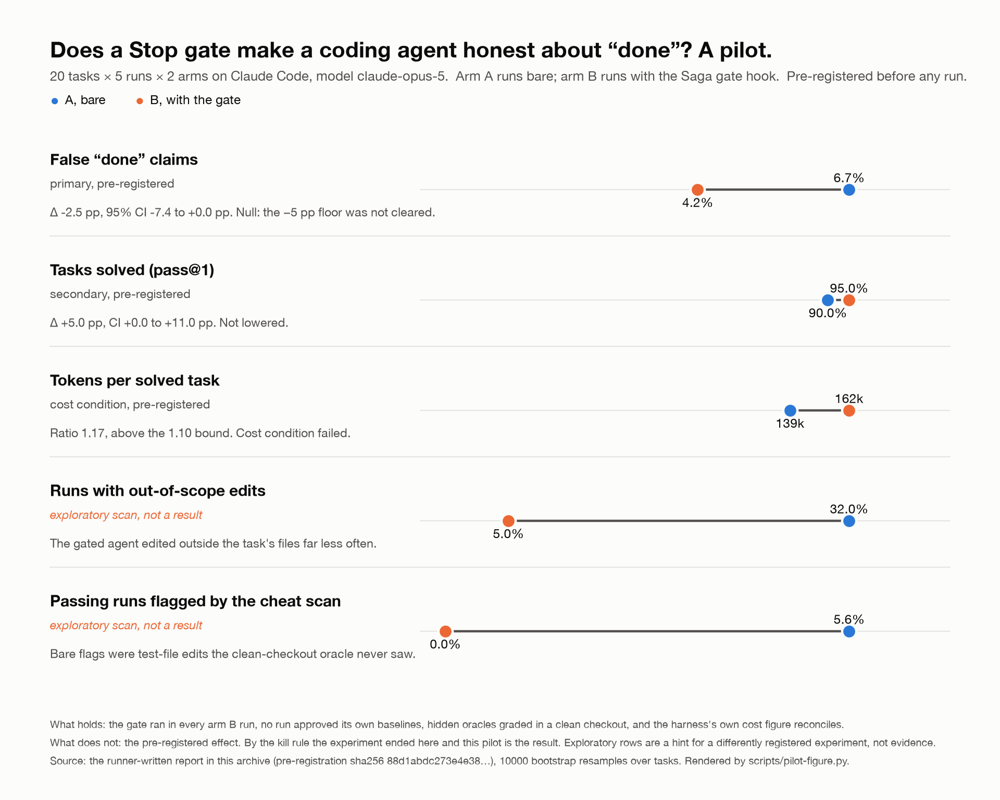

# Saga

> Saga makes any coding agent prove its work: a local, model-agnostic layer for repository knowledge, machine-checked completion, memory that survives compaction, and privacy at the tool boundary, with a benchmark that keeps it honest.

**Status: the pre-registered experiment ended on its own kill rule, 2026-09-13.** The pilot (20 tasks × 5 runs × 2 arms, Claude Opus 5 on Claude Code) put the gate's effect on false "done" claims at −2.5 pp, inside the −5 pp floor set before any run, so by [docs/12 §8](docs/12-experiment-protocol.md) the project as scoped is over, the pilot is the published result, and Saga is a bench. The reading is in [docs/14](docs/14-pilot-morning.md); the archive with the runner's untouched report is [bench/results/pilot-2026-09-13](bench/results/pilot-2026-09-13/).

## The result, at a glance



Every number on the figure is the runner-generated report's own (`scripts/pilot-figure.py` reads `compare.json`). The first three rows are pre-registered and read by the rule in docs/12; the last two are exploratory scan outputs and are not evidence for anything until a differently registered experiment tests them.


## Why

Frontier models improve every release, and the complaints do not change: it said done but does not work, it forgot what was agreed an hour ago, it ignored the instructions file, same prompt, different result. The research behind Saga (docs 03 to 08) found that, among frontier models, the choice of harness explains more outcome variance than the choice of model, that prompt-only tools measure far below their advertised effect under independent tests, and that deterministic structure (structural indexes, verification gates, tool-boundary guards) is where the measured gains are. Every number behind those claims carries a source grade in [doc 09 section 1](docs/09-proposal-and-roadmap.md); per [ADR 0009](docs/adr/0009-scope-cut-eight-week-experiment.md) this README quotes none of them until Saga's own benchmark reproduces them.

## What Saga is

1. **A code knowledge layer.** A local, incrementally updated structural index: symbols, references, call graph, test-to-code mapping, conventions.
2. **A contract and gate layer.** A scope contract agreed before work starts, and a gate runner that checks oracles before "done" is accepted.
3. **A typed memory layer.** Decisions, constraints, and conventions as queryable records that survive compaction and are handed to sub-agents verbatim.
4. **A privacy layer.** Local, deterministic redaction of secrets and PII before content leaves the machine.
5. **A routing and budget layer.** A visible token budget and cost-aware model selection for sub-tasks.

Each layer installs independently. See [doc 01](docs/01-charter.md) for the full charter. Under ADR 0009, layers 1, 3 and 5 and the privacy masking in 4 are deferred until the experiment on layer 2 reports; what ships in this period is the contract and gate layer, the trace ledger, the command classifier and the benchmark.

## What Saga is not

- **Not a skills repository.** Prompt text asking the model to behave is the weakest mechanism available; Saga ships prompts only as thin adapters over checked tools.
- **Not a new agent or harness.** Saga does not own the loop; it plugs into whatever loop is already in use.
- **Not a process framework.** It supplies primitives, not planning ceremonies.
- **Not a model wrapper or proxy** that rewrites prompts in flight.

## How it plugs into harnesses

One core binary, `saga`, knows nothing about any vendor's prompt format. It exposes the same capabilities three ways:

- **CLI**: works anywhere a shell can run, including CI.
- **MCP server**: index, memory, and gate tools for harnesses that speak MCP.
- **Thin hook adapters**: per-harness translation only (Claude Code, Codex, Gemini CLI, Cursor, OpenCode), each a few hundred lines with no logic beyond translation. Gate enforcement falls back to CI where a harness has no stop hook.

See [ADR 0003](docs/adr/0003-harness-agnostic-surface.md).

## Roadmap

Cut to the eight-week experiment by [ADR 0009](docs/adr/0009-scope-cut-eight-week-experiment.md); the pre-registration is [doc 12](docs/12-experiment-protocol.md). Weeks run from 2026-09-07.

| Week | Scope | Exit criterion |
|---|---|---|
| **1 Readiness** | claim verification events (trace-spec §5.5 to §5.9) in the Stop step and offline; hook exit-code probe; pins with harness version | Stop block and claim event fire on the live pinned Claude Code; else stop |
| **2 Smoke** | control-arm blocking, two-arm interleaving, containers or the documented worktree substitute, `doctor` hooks-fire probe; smoke tier, 20 runs | Archive verifies; `blocked_reach_attempts` = 0; per-run dollars measured and the estimates replaced |
| **3 to 4 Tasks** | 20 new TypeScript and Python tasks from the missing failure classes (doc 12 §4.2), to 40 total with 8 impossible and 8 hack-bait | All 40 pass `saga bench verify-task`; task set frozen by hash |
| **5 Pilot** | 20 existing tasks, arm A bare vs arm B Saga hooks plus contract, K = 5, interleaved | Kill rule (doc 12 §8): Δfalse-done inside the 5 pp noise floor ends the project as scoped |
| **6 to 7 Full run** | remaining 20 tasks, K = 5; hook-overhead sub-study; infra re-runs; one report from the pooled rows | `report.json` byte-identical on regeneration |
| **8 Report** | false-done, pass@1, pass^5, tokens and cost per solved, scope and cheat rates, hook overhead, dollars; manifests linked; repository pushed | Published whatever the sign |

Budget: under $3,000 (doc 12 §6). One model (Claude Opus 5), one harness (Claude Code), one primary metric (false-done rate).

| Deferred or dropped by ADR 0009 | Returns when |
|---|---|
| guard beyond the bash/zsh classifier and git-tree snapshot (PowerShell, cmd, Windows, masking, package check, MCP gateway) | guard classifier is the second experiment after a positive result |
| trace canary schedule, replay, portable resume | after the experiment reports |
| gate red proof as a requirement, diff guards as blockers, approvals workflow | each by its own pre-registered ablation |
| mem (state block included), index, shape, MCP server, Codex and Gemini adapters | one new ADR per layer, each with a bench ablation, after a positive result |
| route | dropped from the roadmap; a new ADR only |

## Building from source

Requires Go 1.26 or later; no cgo for this milestone.

```sh
make build            # static binary at bin/saga
make test             # go test ./...
make lint             # gofmt and go vet
make bench-hook       # hook cold start p50/p95 over 50 spawns
```

Then, in a repository you want traced:

```sh
saga init                                   # writes .saga/ (gitignore, config skeleton)
saga install --harness claude-code --dry-run  # shows the hook bindings; drop --dry-run to write them
saga doctor                                 # environment, hook registration, usage source, pins
saga trace ledger                           # per-call cost ledger of the latest session
```

## Read the research

| # | Document | Purpose |
|---|---|---|
| 01 | [Charter](docs/01-charter.md) | What Saga is, is not, principles |
| 02 | [Agent self-report](docs/02-agent-self-report.md) | First-person failure modes |
| 03 | [Harness architecture](docs/03-harness-architecture.md) | How agents are built; what is missing |
| 04 | [Ecosystem survey](docs/04-ecosystem-survey.md) | ~60 tools; what works, what is hype |
| 05 | [Code knowledge structures](docs/05-code-knowledge-structures.md) | Indexes, graphs, memory, determinism |
| 08 | [Reference repo review](docs/08-reference-repo-review.md) | Two reference repos: mechanisms, evidence, gaps |
| 09 | [Proposal and roadmap](docs/09-proposal-and-roadmap.md) | Architecture direction and milestones, as written before the cut |
| 11 | [Red-team review](docs/11-red-team-review.md) | Five failure arguments, overstated claims, the scope cut |
| 12 | [Experiment protocol](docs/12-experiment-protocol.md) | Pre-registration: hypotheses, arms, budget, kill rule, timeline |

| ADR | Decision |
|---|---|
| [0001](docs/adr/0001-measurement-first.md) | Ship the measurement harness before any feature |
| [0002](docs/adr/0002-mechanisms-over-prompts.md) | Prefer machine-checked mechanisms over prompt text |
| [0003](docs/adr/0003-harness-agnostic-surface.md) | One core, three surfaces: CLI, MCP, thin hooks |
| [0004](docs/adr/0004-no-llm-narrative-memory.md) | Never inject LLM-written narrative as fact |
| [0005](docs/adr/0005-index-shape.md) | Deterministic AST graph, depth one, four tools |
| [0009](docs/adr/0009-scope-cut-eight-week-experiment.md) | Cut scope to an eight-week experiment on one hook, one harness, one number |

See [docs/README.md](docs/README.md) for the maintained index, including docs 06, 07 and 10 and ADRs 0006 to 0008.

## Principles

From [doc 01](docs/01-charter.md):

- Every rule that can be a check must be a check.
- Evidence over belief: "done" requires stored, reproducible oracle output.
- Collapse branch points before the run; scope and oracles remove ambiguity.
- Lookup beats memory; structure survives compaction, prose does not.
- Token cost is a first-class metric, reported per component.
- Model-agnostic by construction: CLI plus MCP, thin adapters.
- Local first, private by default.
- Measure or do not claim; cost versus time is explicit and logged.

## Contributing

See [CONTRIBUTING.md](CONTRIBUTING.md).

## License

MIT. See [LICENSE](LICENSE).
